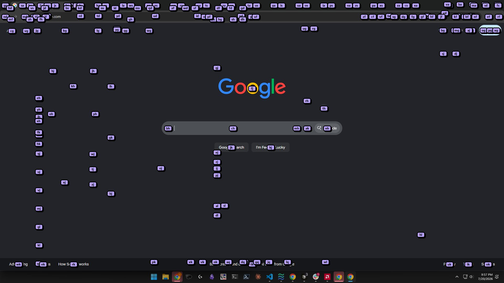

# Window Hints

Keyboard-driven UI hints for Windows. Scan interactive controls with UI Automation, show two-letter codes on a full-screen overlay, and jump the cursor when you type a code.

Runs in the background (tray + global hotkeys). No control window.

## Screenshots

Hints over Google Chrome after the open hotkey (`ctrl+shift+alt`):



## Features

- Full-screen hint overlay across visible windows
- Global hotkey to open/close hints
- Tray menu: quit, scan now
- Optional `user_settings.json` for hotkey, colors, and scan workers
- Optional `.exe` build via PyInstaller (`build-exe.ps1`)
- Cache + background refresh for snappy open

## Install

```powershell
git clone https://github.com/2eezy77/window-hints.git
cd window-hints
python -m pip install -r requirements.txt
```

## Run / demo

```powershell
python -m multiwindow_ui_hints
```

Or elevated (recommended for hints inside admin apps):

```powershell
powershell -ExecutionPolicy Bypass -File .\Run-UI-Hints.ps1
```

A tray icon appears after startup. Press the open hotkey, type a two-letter code, and the cursor moves to that control.

### Essential hotkeys

| Action | Key |
|--------|-----|
| Open / close overlay | `ctrl+shift+alt` (configurable) |
| Cancel overlay | `Esc` |
| Undo last letter | `Backspace` |

## Build `.exe` (optional)

```powershell
powershell -ExecutionPolicy Bypass -File .\build-exe.ps1
```

Output: `dist\MultiwindowUIHints.exe`

## More detail

Configuration, performance notes, and layout: [docs/FULL_README.md](docs/FULL_README.md)

## License

MIT — see [LICENSE](LICENSE).
